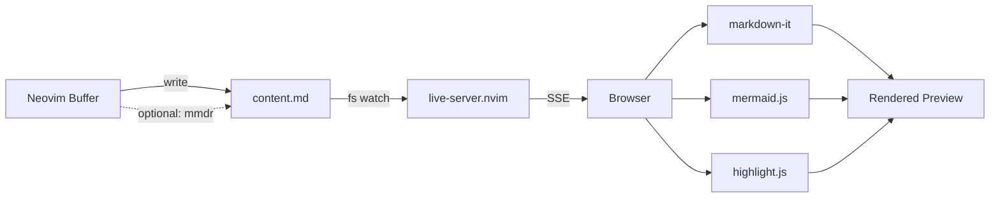

# markdown-preview.nvim

> **Note:** This repository was previously known as `mermaid-playground.nvim`. It has been renamed and rewritten to support full Markdown preview alongside first-class Mermaid diagram support.

Live **Markdown preview** for Neovim with first-class **Mermaid diagram** support.

- Renders your entire `.md` file in the browser — headings, tables, code blocks, everything
- **Mermaid diagrams** render inline as interactive SVGs (click to expand, zoom, pan, export)
- **Instant updates** via Server-Sent Events (no polling) with **scroll sync** — browser follows your cursor
- **LaTeX math** — inline `$...$` and display `$$...$$` rendered via KaTeX
- **Syntax highlighting** for code blocks (highlight.js)
- Dark / Light theme toggle with colored heading accents
- **Optional Rust-powered rendering** — use [`mermaid-rs-renderer`](https://github.com/mermaid-rs/mermaid-rs-renderer) for ~400x faster mermaid diagrams
- **Zero external dependencies** — no npm, no Node.js, just Neovim + your browser
- Powered by [`live-server.nvim`](https://github.com/selimacerbas/live-server.nvim) (pure Lua HTTP server)

---

## Quick start

### Install (lazy.nvim)

```lua
{
  "selimacerbas/markdown-preview.nvim",
  dependencies = { "selimacerbas/live-server.nvim" },
  config = function()
    require("markdown_preview").setup({
      -- all optional; sane defaults shown
      port = 8421,
      open_browser = true,
      debounce_ms = 300,
    })
  end,
}
```

No prereqs. No `npm install`. Just install and go.

### Use it

Open any Markdown file, then:

- **Start preview:** `:MarkdownPreview`
- **Edit freely** — the browser updates instantly as you type
- **Force refresh:** `:MarkdownPreviewRefresh`
- **Stop:** `:MarkdownPreviewStop`

> The first start opens your browser. Subsequent updates reuse the same tab.

**`.mmd` / `.mermaid` files** are fully supported — the entire file is rendered as a diagram.

For **other non-markdown files**, place your cursor inside a fenced ```` ```mermaid ```` block — the plugin extracts and previews just that diagram.

---

## Commands

| Command                  | Description          |
|--------------------------|----------------------|
| `:MarkdownPreview`       | Start preview        |
| `:MarkdownPreviewRefresh`| Force refresh        |
| `:MarkdownPreviewStop`   | Stop preview         |

No keymaps are set by default — map them however you like. Suggested:

```lua
vim.keymap.set("n", "<leader>mps", "<cmd>MarkdownPreview<cr>", { desc = "Markdown: Start preview" })
vim.keymap.set("n", "<leader>mpS", "<cmd>MarkdownPreviewStop<cr>", { desc = "Markdown: Stop preview" })
vim.keymap.set("n", "<leader>mpr", "<cmd>MarkdownPreviewRefresh<cr>", { desc = "Markdown: Refresh preview" })
```

---

## Browser UI

The preview opens a polished browser app with:

- **Full Markdown rendering** — GitHub-flavored styling with colored heading borders, lists, tables, blockquotes, code, images, links, horizontal rules
- **Syntax-highlighted code blocks** — powered by highlight.js, with language badges
- **Interactive Mermaid diagrams** — rendered inline as SVGs:
  - Hover a diagram to reveal the **expand button**
  - Click to open a **fullscreen overlay** with zoom, pan, fit-to-width/height, and SVG export
- **Dark / Light theme** toggle (sun/moon icon in header)
- **Live connection indicator** — green dot when SSE is connected
- **Per-diagram error handling** — if one mermaid block is invalid, only that block shows an error; the rest of the page renders fine
- **LaTeX math rendering** — `$E = mc^2$` inline and `$$\int_0^\infty$$` display math via KaTeX, plus `\begin{equation}` environments
- **Scroll sync** — browser follows your cursor position with line-level precision
- **Iconify auto-detection** — icon packs like `logos:google-cloud` are loaded on demand

---

## Configuration

```lua
require("markdown_preview").setup({
  port = 8421,                          -- server port
  open_browser = true,                  -- auto-open browser on start

  content_name = "content.md",          -- workspace content file
  index_name = "index.html",            -- workspace HTML file
  workspace_dir = nil,                  -- nil = per-buffer (recommended); set a path to override

  overwrite_index_on_start = true,      -- copy plugin's index.html on every start

  auto_refresh = true,                  -- auto-update on buffer changes
  auto_refresh_events = {               -- which events trigger refresh
    "InsertLeave", "TextChanged", "TextChangedI", "BufWritePost"
  },
  debounce_ms = 300,                    -- debounce interval
  notify_on_refresh = false,            -- show notification on refresh

  mermaid_renderer = "js",              -- "js" (browser mermaid.js) or "rust" (mmdr CLI, ~400x faster)

  scroll_sync = true,                   -- browser follows cursor position
})
```

---

## Example



---

## How it works

```
Neovim buffer
    |
    |  (autocmd: debounced write)
    v
workspace/content.md
    |
    |  (live-server.nvim detects change)
    v
SSE event --> Browser
    |
    |  markdown-it --> HTML
    |  mermaid.js  --> inline SVG diagrams
    |  highlight.js --> syntax highlighting
    |  morphdom    --> efficient DOM diffing
    v
Rendered preview (scroll preserved, no flicker)
```

- **Rust renderer** (`mermaid_renderer = "rust"`): mermaid fences are pre-rendered to SVG via the `mmdr` CLI before writing to `content.md` — the browser receives ready-made SVGs with no mermaid.js overhead. Failed blocks fall back to browser-side rendering automatically.
- **Markdown files**: The entire buffer is written to `content.md`
- **Mermaid files** (`.mmd`, `.mermaid`): The entire buffer is wrapped in a mermaid code fence
- **Other files**: The mermaid block under the cursor is extracted (via Tree-sitter or regex fallback) and wrapped in a code fence
- **SSE** (Server-Sent Events) from `live-server.nvim` push updates instantly — no polling
- **morphdom** diffs the DOM efficiently, preserving scroll position and interactive state
- **Per-buffer workspaces** under `~/.cache/nvim/markdown-preview/<hash>/` prevent collisions between Neovim instances

---

## Dependencies

- **Neovim** 0.9+
- **[live-server.nvim](https://github.com/selimacerbas/live-server.nvim)** — pure Lua HTTP server (no npm)
- **Tree-sitter** with the **Markdown** parser (recommended for mermaid block extraction)
- **[mermaid-rs-renderer](https://github.com/mermaid-rs/mermaid-rs-renderer)** (optional) — `cargo install mermaid-rs-renderer` for ~400x faster mermaid rendering. Set `mermaid_renderer = "rust"` in config to enable.

Browser-side libraries are loaded from CDN (cached by your browser):
- [markdown-it](https://github.com/markdown-it/markdown-it) — Markdown parser
- [KaTeX](https://katex.org/) + [markdown-it-texmath](https://github.com/goessner/markdown-it-texmath) — LaTeX math rendering
- [Mermaid](https://mermaid.js.org/) — diagram engine
- [highlight.js](https://highlightjs.org/) — syntax highlighting
- [morphdom](https://github.com/patrick-steele-idem/morphdom) — DOM diffing

---

## Troubleshooting

**Browser shows nothing or "Loading..."**
- Make sure `live-server.nvim` is installed and loadable: `:lua require("live_server")`
- Check the port isn't in use: change `port` in config

**Mermaid diagram not rendering**
- The diagram syntax must be valid Mermaid — check the error chip on the diagram block
- Invalid diagrams show the last good render + error message

**Port conflict**
- Stop with `:MarkdownPreviewStop`, change `port` in config, restart with `:MarkdownPreview`

---

## Project structure

```
markdown-preview.nvim/
├─ plugin/markdown-preview.lua       -- commands + keymaps
├─ lua/markdown_preview/
│  ├─ init.lua                       -- main logic (server, refresh, workspace)
│  ├─ util.lua                       -- fs helpers, workspace resolution
│  └─ ts.lua                         -- Tree-sitter mermaid extractor + fallback
└─ assets/
   └─ index.html                     -- browser preview app
```

---

## Thanks

- [Mermaid](https://mermaid.js.org/) for the diagram engine
- [Iconify](https://iconify.design/) for icon packs
- [markdown-it](https://github.com/markdown-it/markdown-it) for Markdown parsing
- [highlight.js](https://highlightjs.org/) for syntax highlighting
- [morphdom](https://github.com/patrick-steele-idem/morphdom) for efficient DOM updates

PRs and ideas welcome!
